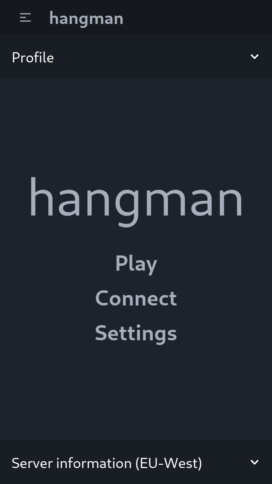
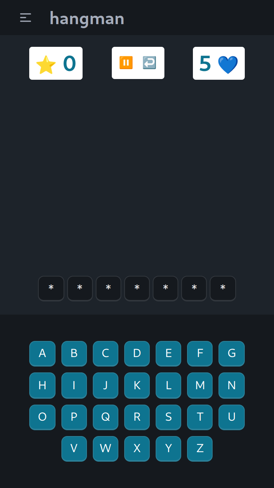
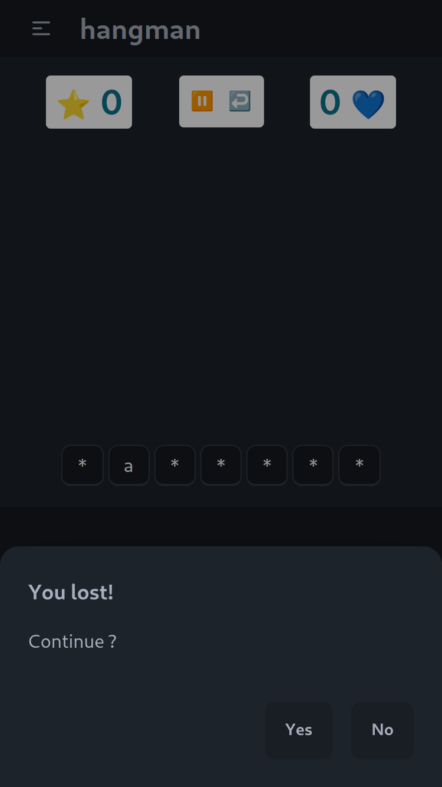

# Hangman

Mobile and desktop hangman guessing game using VueJS and FastAPI.

</img> </img> </img>

## Running


<details>
    <summary>Basic commands</summary>

The frontend, the backend and the database live in Docker containers. Utility scripts can be found in the `scripts` directory.

To start the development environment, run from the project root:

```commandline
bash ./scripts/run-dev.sh [--options]
```

To start the production environment, run from the project root:

```commandline
bash ./scripts/run-prod.sh [--options]
```

You can specify Docker options like `--build`.
Services can also be started individually with :

```commandline
docker compose up [--options] <docker-service>
```
</details>

Currently both are accessible through your local network.
The frontend is served to `localhost:5173` in dev and `localhost:80` in prod.
The backend is served to `localhost:8000` in both environments, currently.


However backend services depend on database services, starting the former will start up the latter.


## Infrastructure

<details>
    <summary>How do the docker services look like?</summary>

Two environments (docker profiles) are currently set up, `dev` and `prod`.

Services are setup following this naming scheme :
- `postgres-[profile]`
- `backend-[profile]`
- `frontend-[profile]`

For example, to build and spin up the frontend service with `dev` profile in detached mode :

```commandline
docker compose up -d --build frontend-dev
```

Attention: when directly spinning up backend services you have to copy `pyproject.toml` and `poetry.lock` to the `app` directory.
</details>


## Features
 - Separate development and production services
 - Seperate development and production networks
 - Quick and easy spin up
 - PostgreSQL database
 - FastAPI backend
 - Asynchronous database interface using `asyncio` and `asyncpg`
 - User login with `JWT` access tokens
 - User roles
 - Securised routes using `OAuth2` scopes.
 - Websocket route for server information
 - Administration dashboard
 - Responsive Vue3 frontend
 - Type safety with Typescript and Python type hints.

<details>
    <summary>More detail</summary>

- The database lives in a `Postgresql` container.
- `Python` backend using `FastAPI` and several other utilities like `SQLModel`, `SQLAlchemy` and `Pydantic`. The backend is served using `uvicorn`.
- `Vue3/Typescript` frontend using `vite`. In the development environment the frontend is served using vite, in production `NGINX` is used.
</details>

## To do

- Unit tests
- Backend: User registration and save data
- Backend: Local word cache instead of relying on online
- Frontend: Actual hangman drawings (renders?)
- Frontend: Give loading feedback to user
- Highscore, feedback and settings pages
